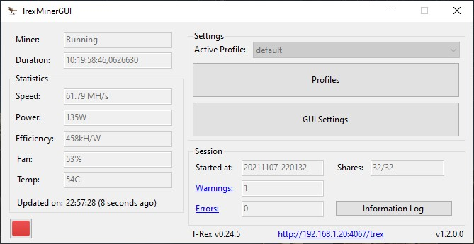

# TrexMinerGUI

A simple Trex -miner- GUI app for single GPU users.

## Features
- Features stopwatch that only runs if miner actually mines
- Profile support
- Validity check for miner arguments
- Shows GPU statistics
- Full automatic updates for both miner (even the miner does not notify user about update) and the application itself
- Filter miner logs for warnings & errors
- Warning indicator on GUI if the miner has been restarted (ex. because of a GPU crash)
- (Optional) Apply selected MSI Afterburner profile on miner startup/termination
- (Optional) Opens at Windows startup
- (Optional) Automatically start miner on app startup

## To-Do
- (Feature) Window for creating miner arguments interactively
- (Feature) Start/Stop the miner based on running apps
- (Feature) Handle miner outputs for LHR cards
- (Feature) Handle miner outputs for dual mining on LHR cards
- (Feature) Duration reset
- (Fix) MSI Afterburner sometimes fails to get terminated after applying profile
- (?) Removal of administrator privilege requirement

## Notes
- It is a simple GUI project for my personal needs.
- You can fork, modify and use the app however you want.
- This application DOES NOT manipulate the earnings of the T-Rex team or the miner.